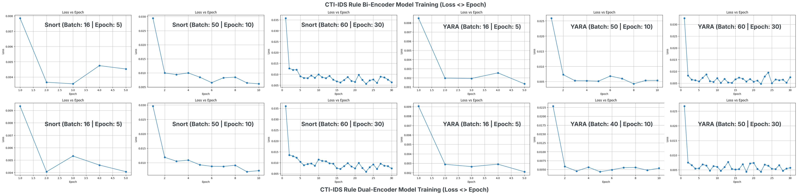
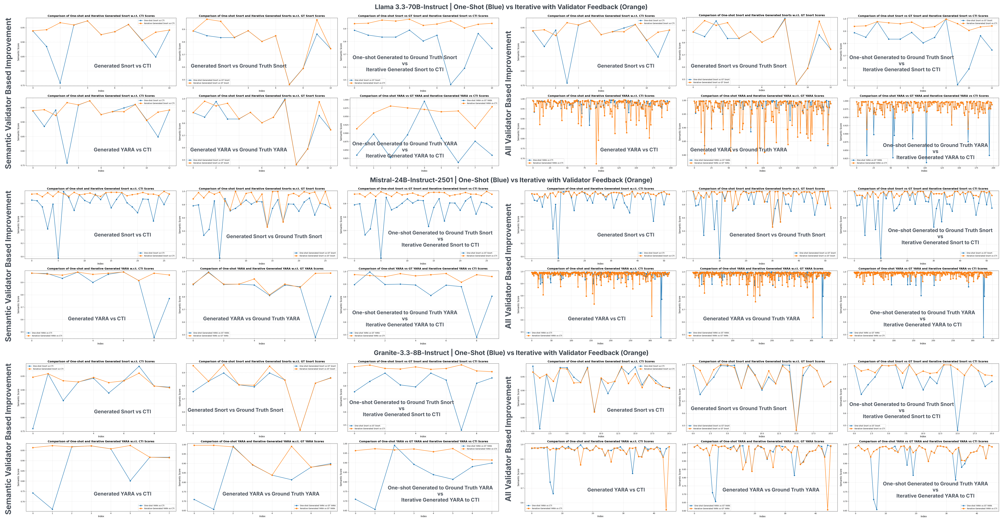

# FALCON: Transforming Cyber Threat Intelligence into Deployable IDS Rules with Self-Reflection

This Readme accompanies the research paper Appendix for review.

---

## 📊 Experimental Evaluation Summary

### Encoder Training Stability

We evaluate encoder convergence across:

- **Batch sizes:** 16, 40–50, 50–60
- **Epochs:** 5, 10, 30
- **Rule Types:** Snort & YARA
- **Architectures:** Bi-Encoder & Dual-Encoder

✅ All configurations exhibit:

- **Rapid convergence**
- **Stable loss**
- **Strong generalization**

---

### End-to-End Rule Generation Performance

We assess:

- **One-shot vs Iterative generation**
- **Semantic-only vs Full-validator feedback**
- **Three different LLM backbones**
- **Two rule types: Snort & YARA**

✅ Iterative refinement consistently:

- Improves **CTI alignment**
- Improves **ground truth similarity**
- Reduces syntactic and performance errors

---

## 📎 Appendix — Additional Evaluation

This appendix presents **additional experimental results supporting the main findings** of the FALCON framework.

---

### 🔹 Encoder Training Dynamics

**Figure 7:** `cti-rule_training_plot_v3.png`  
Training loss across epochs for:

- **Bi-Encoder (Top Row)**
- **Dual-Encoder (Bottom Row)**

Evaluated on:

- Snort & YARA rule scoring
- Batch/Epoch configs:
  - Batch 16 / Epoch 5
  - Batch 40–50 / Epoch 10
  - Batch 50–60 / Epoch 30

✅ All configurations demonstrate:

- Rapid convergence in early epochs
- Stabilized loss between **0.002 – 0.010**
- Consistent learning across architectures and rule types

#### 📈 Figure 7 — Encoder Training Convergence

---

### 🔹 End-to-End Iterative vs One-Shot Evaluation

**Figure 8:** `full_e2e_eval_plot.png`

Comparison across:

- **Llama 3.3-70B-Instruct**
- **Mistral-24B-Instruct-2501**
- **Granite-3.3-8B-Instruct**

Evaluation includes:

#### Semantic Validator Only (Left Panel)

- Generated Rule vs CTI
- Generated Rule vs Ground Truth
- One-shot vs Iterative improvement

#### All Validators Enabled (Right Panel)

- Syntactic + Semantic + Performance feedback
- Progressive improvement across:
  - CTI alignment
  - Ground truth similarity
  - Performance optimization

✅ Results conclusively show:

- Iterative validator-guided generation **outperforms one-shot generation**
- Improvements are consistent across **models and rule types**

---

#### 📊 Figure 8 — End-to-End Iterative vs One-Shot Performance

---
